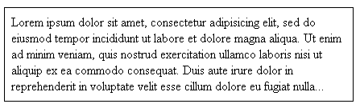

#VerticalTrunc

A small jQuery plugin that appropriately truncates a block of multi-line text, adding elipses when necessary.  It will re-adjust the truncation whenever the page resizes.

#Usage

1. Add VerticalTrunc.js to your page.

2. Call the plugin: 
        
        $("mybox").verticaltrunc();

#Demo

A demo is available in the demo folder.
